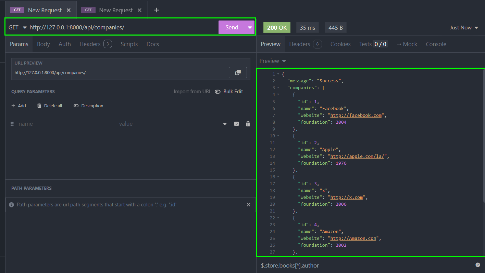
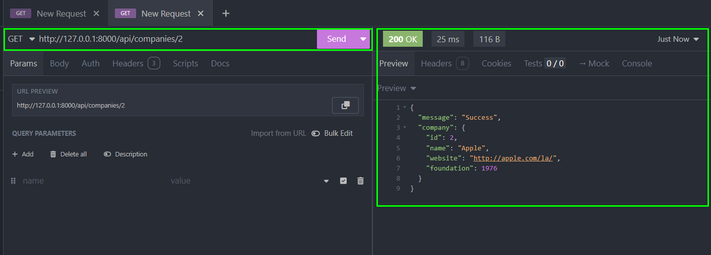

# API con Django y MYSQL

Este proyecto muestra una API hecha con el framework Django y el motor de base de datos MySql. Se usan los métodos HTTP GET, POST, PUT, DELETE. Se maneja información acerca de nombre de empresas tecnológicas como Facebook, Apple, Amazon, se guarda el id, name, website y foundation.

Video explicativo de función de la API: [API con Django y MySql](https://www.youtube.com/watch?v=0TzoarHH0Hg)

## API Documentación

#### Obtener todos los items

```http
  GET /api/companies/
```



#### Obtener solo 1 item

```http
  GET /api/companies/{id}
```



#### Guardar un item

```http
  POST /api/companies/
```

Enviar un json con la siguiente estructura:

```json
{
  "name": string,
  "website": string,
  "foundation": integer

}
```

#### Actualizar un item

```http
  PUt /api/companies/{id}
```

#### Borrar un item

```http
  DELETE /api/companies/{id}
```
